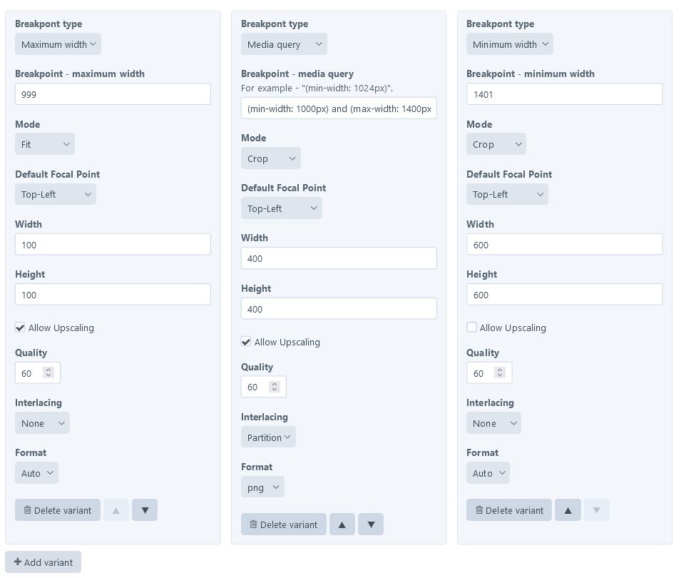

# Image variants field (PRO edition)

The PRO version of Image toolbox allows users to define picture sources configurations with the control panel interface. This can be done using **Image variants** field. 



## Outputting pictures defined by variants field

To define settings for all images in the asset source, assign variant field to its field layout. In the **field settings**, you will be able to set:

* Transform settings and breakpoints for sources.
* If `<picture>` should be rendered with width and height attributes
* If `<picture>` should have webp variants of sources

You can also do the same for specific asset, using **field values**. Configuration set in the specific assets will **overwrite** one set in field settings.

To output `<picture`> element, you can use `pictureFromAsset()` method. This method takes in asset object (or `null` which will generate placeholder), handle of variant field assigned to asset source as parameters and optional array of the HTML attributes.

```twig


{{craft.images.pictureFromAsset(img, 'variantField', htmlAttributes)}}
```

Theoretically, you can pass only the asset object to this method and skip variant field handle.  Hovewer, if image is missing (and we have `null` null instead of asset object), without field handle plugin will not be able select specific variant field to take picture configuration from. This means that it will be unable to generate placeholder using specific width and height set in the field.